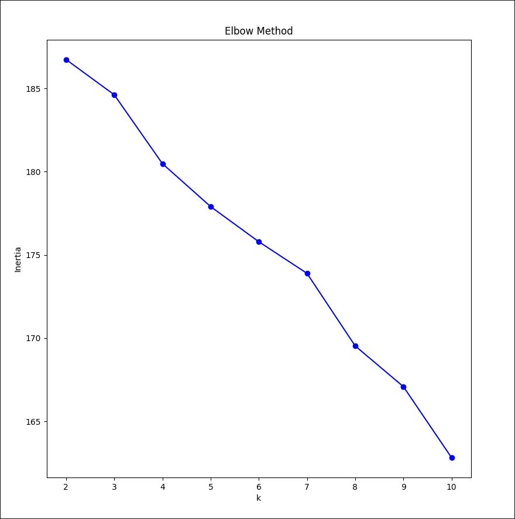
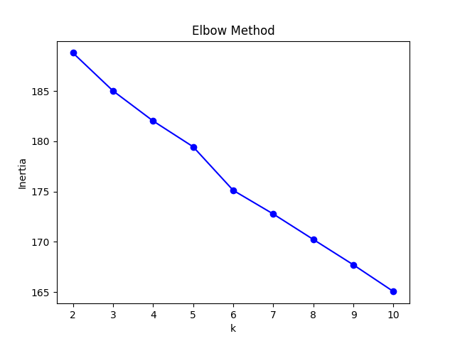

# Run 1:

Starting with 46 pieces of text, 17 from OCR training material, rest from news
sites.

```
Training done, models saved.
Cluster 0: ['शिक्षा', 'मानव', 'अधिकार', 'राष्ट्रिय', 'योग']
Cluster 1: ['गोल', 'छ', 'खेलमा', 'स्थानमा', 'अंकमा']
Cluster 2: ['सूचना', 'मिति', 'नेपाल', 'प्रकाशित', 'सञ्चालन']
Cluster 3: ['छन्', 'छ', 'हजार', 'रूपमा', 'पनि']
Cluster 4: ['पिज्जा', 'करोड', 'दशमलव', 'छ', 'पहिलो']
```

# Run 2

Added new stopwords. This will be regularly done before further subsequent
runs, hence it will not be mentioned further.

```
Training done, models saved.
Cluster 0: ['मानव', 'अधिकार', 'पिज्जा', 'मानव अधिकार', 'राष्ट्रिय']
Cluster 1: ['हजार', 'दशमलव', 'विद्यार्थी', 'सहभागी', 'साबित']
Cluster 2: ['सूचना', 'मिति', 'नेपाल', 'भाषा', '.']
Cluster 3: ['करोड', 'केन्द्रीय', 'छिन्', 'भने', 'वैदेशिक']
Cluster 4: ['रूपमा', 'समेत', 'तेल', 'गर्न', 'इमेल']
```

# Run 3

```
Training done, models saved.
Cluster 0: ['मानव', 'अधिकार', 'पिज्जा', 'मानव अधिकार', 'राष्ट्रिय']
Cluster 1: ['हजार', 'दशमलव', 'विद्यार्थी', 'सहभागी', 'साबित']
Cluster 2: ['सूचना', 'मिति', 'नेपाल', 'भाषा', '०१']
Cluster 3: ['करोड', 'केन्द्रीय', 'थियो', '’', 'व्यहोर्नु']
Cluster 4: ['रूपमा', 'समेत', 'तेल', 'इमेल', 'पेश']
```

# Run 4

```
Training done, models saved.
Cluster 0: ['पिज्जा', 'मानव', 'योग', 'अधिकार', 'शिक्षा']
Cluster 1: ['हजार', 'दशमलव', 'विद्यार्थी', 'सहभागी', 'साबित']
Cluster 2: ['सूचना', 'मिति', 'नेपाल', 'भाषा', 'यस']
Cluster 3: ['करोड', 'केन्द्रीय', 'थियो', 'उनको', 'सडक']
Cluster 4: ['रूपमा', 'समेत', 'तेल', 'इमेल', 'पेश']
```

# Run 5

```
Training done, models saved.
Cluster 0: ['पिज्जा', 'मानव', 'योग', 'अधिकार', 'शिक्षा']
Cluster 1: ['हजार', 'दशमलव', 'विद्यार्थी', 'सहभागी', 'साबित']
Cluster 2: ['सूचना', 'मिति', 'नेपाल', 'भाषा', 'यस']
Cluster 3: ['करोड', 'केन्द्रीय', 'सडक', 'व्यहोर्नु', 'आर्थिक']
Cluster 4: ['रूपमा', 'समेत', 'मात्र', 'क्रिकेट', 'तेल']
```

# Run 6

For this run, `min_df` was set as 2 for the `TfidfVectorizer`, to only have
words that appear in at least two documents as keywords.

No new stopwords added.

```
Training done, models saved.
Cluster 0: ['राष्ट्रिय', 'मानव', 'अधिकार', 'गोल', 'दिवस']
Cluster 1: ['हजार', 'विद्यार्थी', 'सहभागी', 'साबित', 'समारोहमा']
Cluster 2: ['सूचना', 'मिति', 'भाषा', 'नेपाल', 'यस']
Cluster 3: ['करोड', 'केन्द्रीय', 'वैदेशिक', 'आर्थिक', 'अर्ब']
Cluster 4: ['रूपमा', 'तेल', 'हो', 'समय', 'मुख्य']
```

# Run 7

```
Training done, models saved.
Cluster 0: ['राष्ट्रिय', 'मानव', 'अधिकार', 'गोल', 'दिवस']
Cluster 1: ['हजार', 'विद्यार्थी', 'सहभागी', 'साबित', 'समारोहमा']
Cluster 2: ['सूचना', 'मिति', 'नेपाल', 'भाषा', 'गते']
Cluster 3: ['करोड', 'केन्द्रीय', 'वैदेशिक', 'आर्थिक', 'अर्ब']
Cluster 4: ['तेल', 'मात्र', 'मुख्य', 'समेत', 'मौसम']
```

# Run 8

Added 7 new text files.

```
Training done, models saved.
Cluster 0: ['तेल', 'गर्छ', 'यी', 'मानिन्छ', 'राखेर']
Cluster 1: ['हजार', 'फिल्म', 'विद्यार्थी', 'फिल्मको', 'गर्ने']
Cluster 2: ['सूचना', 'भाषा', 'समेत', 'पेश', 'इमेल']
Cluster 3: ['गोल', 'गरेको', 'खेलमा', 'क्रिकेट', 'सार्वजनिक']
Cluster 4: ['मिति', 'नेपाल', 'राष्ट्रिय', 'शिक्षा', 'मानव']
```

# Run 9

```
Training done, models saved.
Cluster 0: ['तेल', 'गर्छ', 'पहिलो', 'विभिन्न', 'मानिन्छ']
Cluster 1: ['हजार', 'फिल्म', 'विद्यार्थी', 'फिल्मको', 'पहिलो']
Cluster 2: ['सूचना', 'भाषा', 'समेत', 'पेश', 'इमेल']
Cluster 3: ['गोल', 'खेलमा', 'दुई', 'गरेको', 'क्रिकेट']
Cluster 4: ['मिति', 'नेपाल', 'राष्ट्रिय', 'शिक्षा', 'मानव']
```

# Run 10

```
Training done, models saved.
Cluster 0: ['तेल', 'पहिलो', 'विभिन्न', 'साबित', 'ले']
Cluster 1: ['हजार', 'फिल्म', 'सार्वजनिक', 'केन्द्रीय', 'फिल्मको']
Cluster 2: ['सूचना', 'भाषा', 'समेत', 'पेश', 'इमेल']
Cluster 3: ['गोल', 'खेलमा', 'दुई', 'पराजित', 'स्थानमा']
Cluster 4: ['मिति', 'नेपाल', 'राष्ट्रिय', 'शिक्षा', 'मानव']
```

# Run 11

Adjusted some of the preprocessing to remove Devanagari digits and some
special characters that were previously missed.

```
Training done, models saved.
Cluster 0: ['तेल', 'साबित', 'राखेर', 'विभिन्न', 'समय']
Cluster 1: ['हजार', 'फिल्म', 'सार्वजनिक', 'केन्द्रीय', 'फिल्मको']
Cluster 2: ['सूचना', 'भाषा', 'पेश', 'समेत', 'सञ्चालन']
Cluster 3: ['गोल', 'खेलमा', 'गर्दै', 'पराजित', 'स्थानमा']
Cluster 4: ['मिति', 'नेपाल', 'राष्ट्रिय', 'शिक्षा', 'मानव']
```

# Run 12

```
Training done, models saved.
Cluster 0: ['तेल', 'साबित', 'राखेर', 'विभिन्न', 'समय']
Cluster 1: ['हजार', 'फिल्म', 'सार्वजनिक', 'केन्द्रीय', 'फिल्मको']
Cluster 2: ['सूचना', 'भाषा', 'पेश', 'समेत', 'सञ्चालन']
Cluster 3: ['गोल', 'खेलमा', 'पराजित', 'स्थानमा', 'खेल']
Cluster 4: ['मिति', 'नेपाल', 'राष्ट्रिय', 'शिक्षा', 'मानव']
```

# Run 13

Set number of clusters to 6.

```
Training done, models saved.
Cluster 0: ['तेल', 'खाना', 'साबित', 'राखेर', 'समय']
Cluster 1: ['हजार', 'फिल्म', 'फिल्मको', 'केन्द्रीय', 'भारतीय']
Cluster 2: ['सूचना', 'भाषा', 'पेश', 'व्यक्ति', 'इमेल']
Cluster 3: ['गोल', 'खेलमा', 'पराजित', 'स्थानमा', 'स्पष्ट']
Cluster 4: ['राष्ट्रिय', 'मौसम', 'प्रतिशतले', 'लाख', 'वि.सं.']
Cluster 5: ['मिति', 'शिक्षा', 'नेपाल', 'मानव', 'खेल']
```

# Run 14

Scraped 150 articles from Ekantipur. Set number of clusters back to 5.

```
Training done, models saved.
Cluster 0: ['mins read', 'mins', 'read', 'उनी', 'चैत्र']
Cluster 1: ['हजार', 'लाख', 'करोड', 'लाख हजार', 'रुपैयाँ']
Cluster 2: ['सूचना', 'मिति', 'खेल', 'नेपाल', 'प्रहरी']
Cluster 3: ['शिक्षा', 'स्वास्थ्य', 'सार्वजनिक', 'बिमा', 'जेको जे']
Cluster 4: ['थिए', 'गोल', 'अंकमा', 'गरेका', 'खेलमा']
```

# Run 15

Adjusted the preprocessor to remove all English letters.

```
Training done, models saved.
Cluster 0: ['राष्ट्रिय', 'राजीनामा', 'केन्द्रीय', 'नयाँ', 'मानव']
Cluster 1: ['हजार', 'लाख', 'रुपैयाँ', 'करोड', 'लाख हजार']
Cluster 2: ['खेल', 'उनी', 'उनले', 'गोल', 'क्रिकेट']
Cluster 3: ['विभिन्न', 'प्रहरी', 'निपाह', 'भएका', 'शिक्षा']
Cluster 4: ['सेवा', 'स्वास्थ्य', 'सूचना', 'बिमा', 'स्वास्थ्य बिमा']
```

An elbow plot diagram was plotted using `plot_elbow.py` to find an ideal value
for $k$:



A noticeable dip is present after 7, however it is ideal to check the $k$
values around it too, to see how it reflects in the keywords.

# Run 16

Set number of clusters to 6.

```
Training done, models saved.
Cluster 0: ['राजीनामा', 'केन्द्रीय', 'नयाँ', 'सभापति', 'दलको']
Cluster 1: ['हजार', 'लाख', 'रुपैयाँ', 'करोड', 'लाख हजार']
Cluster 2: ['खेल', 'उनी', 'उनले', 'गोल', 'क्रिकेट']
Cluster 3: ['विभिन्न', 'समेत', 'भएका', 'प्रहरी', 'निपाह']
Cluster 4: ['स्वास्थ्य', 'सेवा', 'बिमा', 'स्वास्थ्य बिमा', 'बोर्डले']
Cluster 5: ['शिक्षा', 'सूचना', 'मिति', 'जेको', 'जेको जे']
```

# Run 17

Set number of clusters to 7.

```
Training done, models saved.
Cluster 0: ['राजीनामा', 'केन्द्रीय', 'सभापति', 'पार्टी', 'अस्वीकृत']
Cluster 1: ['हजार', 'लाख', 'रुपैयाँ', 'करोड', 'लाख हजार']
Cluster 2: ['खेल', 'गोल', 'क्रिकेट', 'अंकमा', 'खेलमा']
Cluster 3: ['समेत', 'कारण', 'हुन्छ', 'निपाह', 'नेपाली']
Cluster 4: ['स्वास्थ्य', 'सेवा', 'बिमा', 'स्वास्थ्य बिमा', 'बोर्डले']
Cluster 5: ['सूचना', 'शिक्षा', 'मिति', 'जेको जे', 'जेको']
Cluster 6: ['उनी', 'उनले', 'चैत्र', 'संसद्', 'राजनीतिक']
```

# Run 18

Set number of clusters to 8.

```
Training done, models saved.
Cluster 0: ['राजीनामा', 'केन्द्रीय', 'कार्यक्रम', 'सभापति', 'समस्या']
Cluster 1: ['हजार', 'लाख', 'सय', 'लाख हजार', 'करोड']
Cluster 2: ['खेल', 'क्रिकेट', 'रन', 'अन्तर्राष्ट्रिय', 'आफ्नो']
Cluster 3: ['स्वास्थ्य', 'सेवा', 'बिमा', 'निर्देशन', 'स्वास्थ्य बिमा']
Cluster 4: ['उनी', 'चैत्र', 'उनले', 'उनको', 'यात्रा']
Cluster 5: ['जेको', 'जेको जे', 'जे', 'सिक्स', 'सिक्स टी']
Cluster 6: ['गोल', 'राष्ट्रिय', 'थिए', 'अध्यक्ष', 'शिक्षा']
Cluster 7: ['रुपैयाँ पैसा', 'पैसा', 'रुपैयाँ', 'बिक्रीदर', 'पैसा बिक्रीदर']
```

# Run 19

Due to excessive irrelevant words in previous run, rerun with 8 after stopword
adjustment.

```
Training done, models saved.
Cluster 0: ['राजीनामा', 'राष्ट्रिय', 'कार्यक्रम', 'के', 'अस्वीकृत']
Cluster 1: ['हजार', 'लाख', 'रुपैयाँ', 'लाख हजार', 'करोड']
Cluster 2: ['खेल', 'क्रिकेट', 'टी', 'सिक्स टी', 'सिक्स']
Cluster 3: ['स्वास्थ्य', 'सेवा', 'सूचना', 'बिमा', 'स्वास्थ्य बिमा']
Cluster 4: ['उनी', 'शिक्षा', 'चैत्र', 'राजनीतिक', 'संसद्']
Cluster 5: ['गोल', 'अंकमा', 'स्थानमा', 'रह्यो', 'खेलमा']
Cluster 6: ['केन्द्रीय', 'दलको', 'गते', 'सांसद', 'छलफल']
Cluster 7: ['अमेरिका', 'राम्रो', 'भनाइ', 'तेल', 'जारी']
```

$k$ = 8 is dismissed due to some clusters being a bit unclear in terms of
topics.

# Run 20

Set $k$ to 7.

```
Training done, models saved.
Cluster 0: ['राजीनामा', 'केन्द्रीय', 'सभापति', 'पार्टी', 'अस्वीकृत']
Cluster 1: ['हजार', 'लाख', 'रुपैयाँ', 'करोड', 'लाख हजार']
Cluster 2: ['खेल', 'गोल', 'क्रिकेट', 'अंकमा', 'खेलमा']
Cluster 3: ['समेत', 'कारण', 'समय', 'हुन्छ', 'निपाह']
Cluster 4: ['स्वास्थ्य', 'सेवा', 'बिमा', 'स्वास्थ्य बिमा', 'बोर्डले']
Cluster 5: ['सूचना', 'शिक्षा', 'मिति', 'सिक्स', 'सिक्स टी']
Cluster 6: ['चैत्र', 'संसद्', 'राजनीतिक', 'नयाँ', 'सांसद']
```

Cluster 3 appears a bit unclear in terms of topics. Additionally, cluster 0
and cluster 6 are too similar. $k$ = 7 is dismissed.

# Run 21

Set $k$ to 6.

```
Training done, models saved.
Cluster 0: ['राजीनामा', 'केन्द्रीय', 'के', 'सभापति', 'पार्टी']
Cluster 1: ['हजार', 'लाख', 'रुपैयाँ', 'लाख हजार', 'हजार सय']
Cluster 2: ['खेल', 'गोल', 'क्रिकेट', 'अंकमा', 'खेलमा']
Cluster 3: ['नयाँ', 'विभिन्न', 'भएका', 'संसद्', 'समय']
Cluster 4: ['स्वास्थ्य', 'सेवा', 'बिमा', 'स्वास्थ्य बिमा', 'बोर्डले']
Cluster 5: ['शिक्षा', 'सूचना', 'सार्वजनिक', 'सिक्स टी', 'सिक्स']
```

Cluster 3 appears a little unclear in terms of topic.

# Run 22

Retrying $k$ = 6 after setting some new stopwords.

```
Training done, models saved.
Cluster 0: ['चैत्र', 'राजीनामा', 'संसद्', 'केन्द्रीय', 'सांसद']
Cluster 1: ['हजार', 'लाख', 'रुपैयाँ', 'करोड', 'लाख हजार']
Cluster 2: ['खेल', 'क्रिकेट', 'गोल', 'अंकमा', 'खेलमा']
Cluster 3: ['समस्या', 'औषधि', 'निपाह', 'प्रयोग', 'अवस्थामा']
Cluster 4: ['स्वास्थ्य', 'सेवा', 'बिमा', 'स्वास्थ्य बिमा', 'बोर्डले']
Cluster 5: ['सार्वजनिक', 'शिक्षा', 'सूचना', 'भयो', 'कार्यक्रम']
```

Cluster 3 is a bit clearer now, and it seems a bit too similar to 4.

# Run 23

Retrying $k$ = 6 again after adding a few more stopwords.

```
Training done, models saved.
Cluster 0: ['चैत्र', 'संसद्', 'राजीनामा', 'केन्द्रीय', 'सांसद']
Cluster 1: ['हजार', 'लाख', 'रुपैयाँ', 'करोड', 'लाख हजार']
Cluster 2: ['खेल', 'क्रिकेट', 'गोल', 'अंकमा', 'खेलमा']
Cluster 3: ['निपाह', 'औषधि', 'समस्या', 'प्रहरी', 'तेल']
Cluster 4: ['स्वास्थ्य', 'सेवा', 'बिमा', 'स्वास्थ्य बिमा', 'बोर्डले']
Cluster 5: ['सार्वजनिक', 'शिक्षा', 'सूचना', 'मिति', 'कार्यक्रम']
```

Cluster 3 is unclear once again with multiple topics appearing in one place.
Multiple attempts have been made with $k$ = 6 but they seem to have been
unsuccessful in creating much clarity. $k$ = 6 is dismissed.

# Run 24

Setting $k$ to 5.

```
Training done, models saved.
Cluster 0: ['चैत्र', 'राष्ट्रिय', 'संसद्', 'राजीनामा', 'केन्द्रीय']
Cluster 1: ['हजार', 'लाख', 'रुपैयाँ', 'करोड', 'लाख हजार']
Cluster 2: ['खेल', 'क्रिकेट', 'गोल', 'नेपाल', 'आफ्नो']
Cluster 3: ['सार्वजनिक', 'शिक्षा', 'समस्या', 'निपाह', 'औषधि']
Cluster 4: ['सेवा', 'स्वास्थ्य', 'बिमा', 'स्वास्थ्य बिमा', 'सूचना']
```

The clusters seem to be clearest here so far in line with the training data.

# Run 25

```
Training done, models saved.
Cluster 0: ['राजीनामा', 'केन्द्रीय', 'राष्ट्रिय', 'सभापति', 'कार्यक्रम']
Cluster 1: ['हजार', 'लाख', 'रुपैयाँ', 'करोड', 'लाख हजार']
Cluster 2: ['खेल', 'गोल', 'क्रिकेट', 'नेपाल', 'अंकमा']
Cluster 3: ['सार्वजनिक', 'शिक्षा', 'परेको', 'यात्रा', 'कारण']
Cluster 4: ['सेवा', 'स्वास्थ्य', 'सूचना', 'बिमा', 'स्वास्थ्य बिमा']
```

# Run 26

```
Training done, models saved.
Cluster 0: ['चैत्र', 'संसद्', 'राजीनामा', 'राष्ट्रिय', 'केन्द्रीय']
Cluster 1: ['हजार', 'लाख', 'रुपैयाँ', 'करोड', 'लाख हजार']
Cluster 2: ['खेल', 'गोल', 'क्रिकेट', 'नेपाल', 'अंकमा']
Cluster 3: ['सार्वजनिक', 'शिक्षा', 'अध्ययन', 'समस्या', 'औषधि']
Cluster 4: ['सेवा', 'स्वास्थ्य', 'बिमा', 'स्वास्थ्य बिमा', 'सूचना']
```

$k$ = 5 seems to be clear enough. The clusters will therefore be labeled as:

- Cluster 0: Politics
- Cluster 1: Finance
- Cluster 2: Sports
- Cluster 3: Society
- Cluster 4: Health

The final elbow plot also supports this statement:


