# Training initial_small dataset

- five documents were randomly picked off of `all_images`
- cleaning and line separation setup done by the process described in readme
- manual ground truth creation done
- total of **93 lines** in the end

## Training

- setup the directory structure in `tesstrain` as

```
data
    nep-ft              (empty)
    nep-ft-ground-truth (dataset)
```

- downloaded tesseract langdata

```bash
make tesseract-langdata
```

### Run 1

```bash
make training MODEL_NAME=nep-ft START_MODEL=nep TESSDATA=./tessdata EPOCHS=10 LANG_TYPE=Indic RANDOM_SEED=42
```

- `nep` model provided by Tesseract stored in `./tessdata`, it is fine tuned
- epochs set to only 10 to avoid overfitting on the small dataset, but still have
    some level of data to show
- learning rate set to `0.0001`, which is default when a `START_MODEL` is given
- train-eval ratio set to `0.9`, which is the default, preferred as the dataset is small

#### Results

Plot of CER:


Log plot of the same:

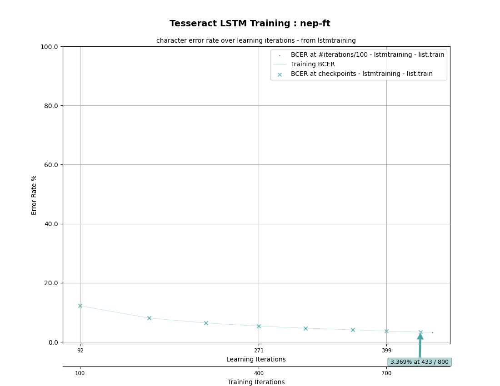

Evaluation results poor, but this is expected as the dataset is small and the
evaluation portion of the set is even smaller.

Textual log of the training process is in `initial_small/run_1/training.log`

### Run 2

```bash
make training MODEL_NAME=nep-ft START_MODEL=nep TESSDATA=./tessdata EPOCHS=10 LEARNING_RATE=0.0005 LANG_TYPE=Indic RANDOM_SEED=42
```

- similar to the last one, but learning rate increased by five times to 0.0005

#### Results

Plot of CER:

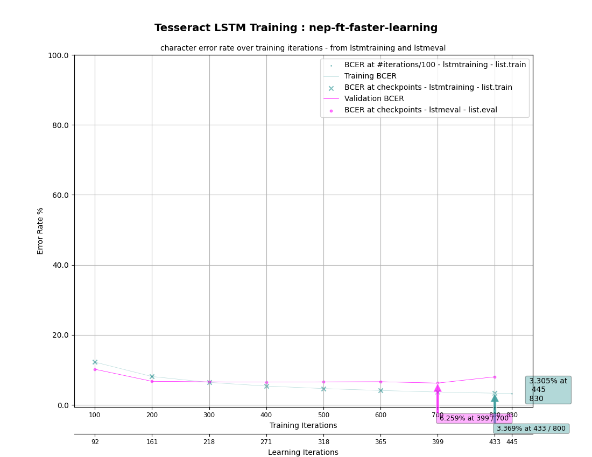

Log plot of the same:

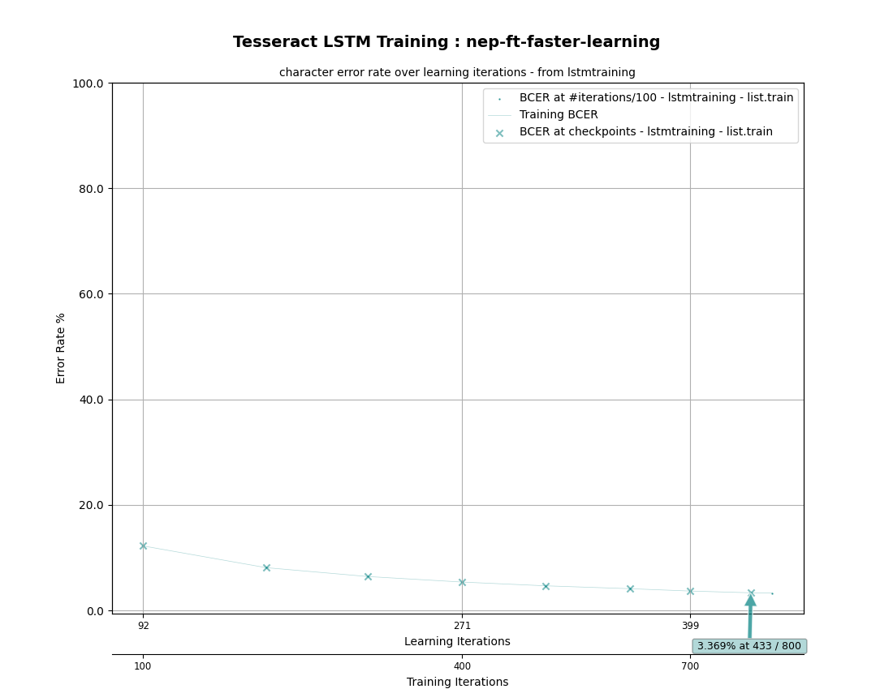

Apparently no difference.

Textual log of the training process is in `initial_small/run_2/training.log`

# Training final dataset

## Dataset preparation

- total of 668 hand-labeled lines + 94 synthetic lines = **762 lines**
- a little over 8x larger than the initial_small set

### Patterns noticed in model mistakes

This was noticed while preparing the dataset, as initial preparation of the
dataset is based on predictions made by the existing Tesseract model; hence the
results reflect what type of errors the base model made mostly.

- ज mistaken for ज्ञ
- struggles differentiating ै and े
- ब often mistaken for च
- struggles with bold text
- struggles a LOT with italicized text
- छ mistaken for च
- द mistaken for ब
- ५ occasionally mistaken for ४
- ो mistaken for ोै
- ु mistaken for ्
- भ mistaken for अ

## Training

- repeat steps as done previously
- setup the directory structure in `tesstrain` as

```
data
    nep-ft              (empty)
    nep-ft-ground-truth (dataset)
```

- downloaded tesseract langdata

```bash
make tesseract-langdata
```

### Run 1

```bash
make training MODEL_NAME=nep-ft START_MODEL=nep TESSDATA=./tessdata EPOCHS=5 LANG_TYPE=Indic RANDOM_SEED=42
```

- `nep` model provided by Tesseract stored in `./tessdata` finetuned again
- epochs set to 5, the training on the initial_small set showed signs of
    overfitting, therefore the epochs are reduced, plus this reduces the amount
    of time taken to train
- learning rate set to `0.0001`, which is default when a `START_MODEL` is given
- train-eval ratio set to `0.9`, which is the default

#### Results

Plot of CER:

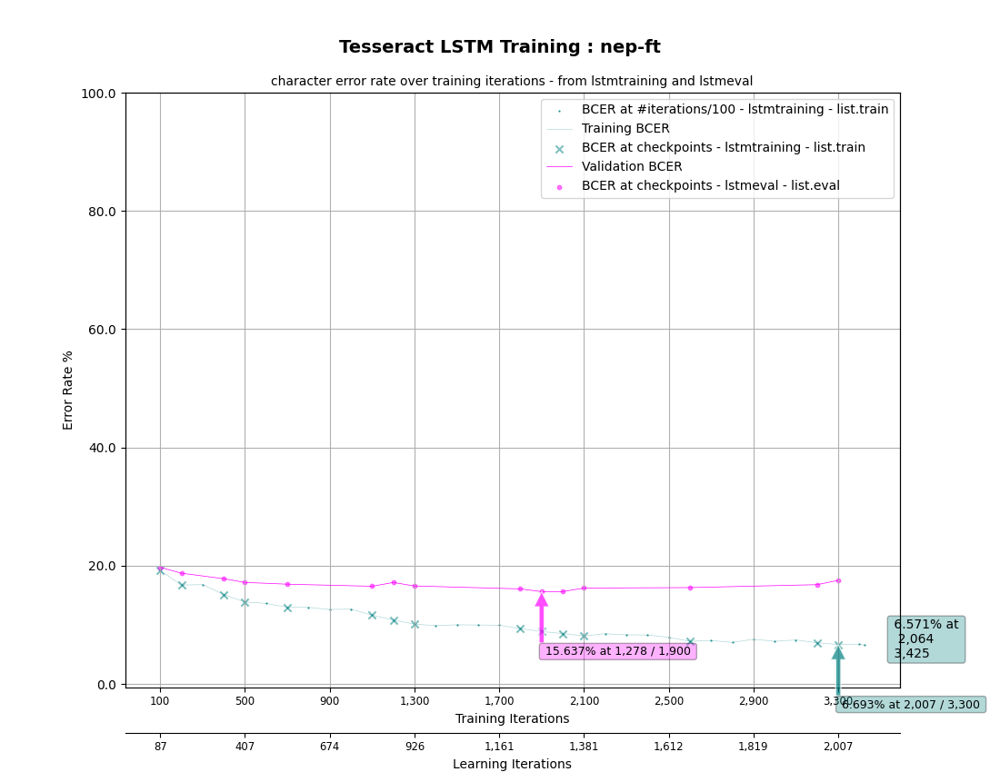

Log plot of the same:

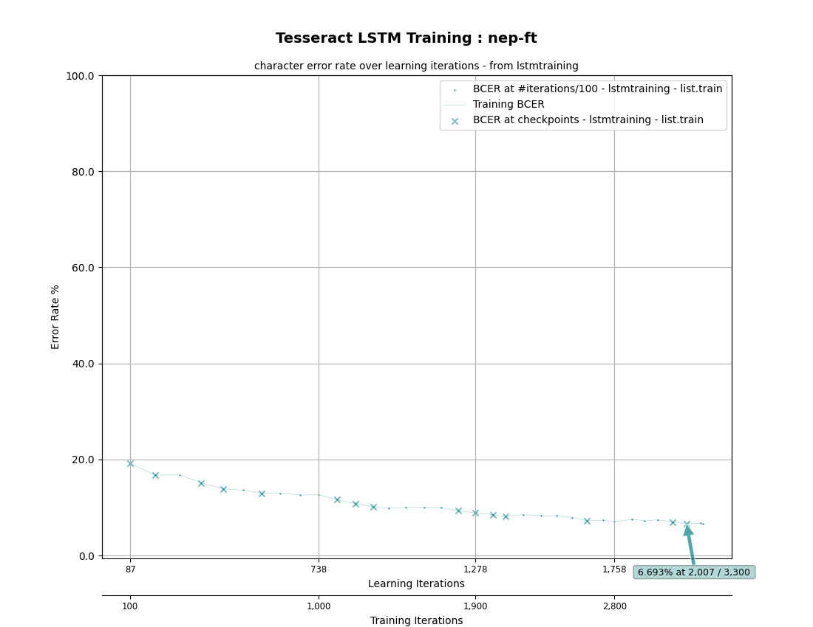

Noticeable improvement on training data itself, but poor generalization to the
rest of the data (evaluation). Clear sign of overfitting.

Textual log of the training process is in `final/run_1/training.log`

### Run 2

```bash
make training MODEL_NAME=nep-ft START_MODEL=nep TESSDATA=./tessdata EPOCHS=2 LEARNING_RATE=0.0005 LANG_TYPE=Indic RANDOM_SEED=42
```

- epochs reduced to 2, as 5 seemed far too much
- learning rate increased by 5 times to 0.0005

#### Results


Plot of CER:

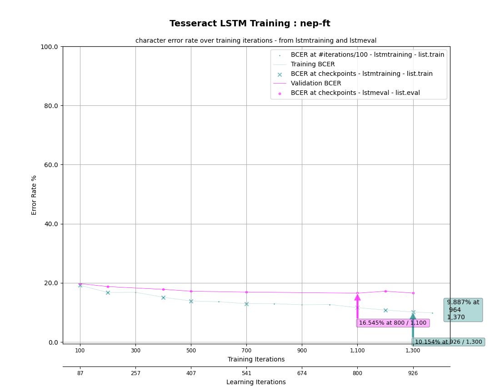

Log plot of the same:


Zero apparent change in the actual process; however the final evaluation error
rates were slightly better than before because the data was seen less and
thus there was less of an opportunity for overfitting.

Textual log of the training process is in `final/run_2/training.log`

### Run 3

- learning rate changes not doing anything was suspicious
- figured out that I had to modify Makefile to add the `--reset_learning_rate` 
    flag, which actually caused the learning rate changes to have effect
- repeated the same command as before

```bash
make training MODEL_NAME=nep-ft START_MODEL=nep TESSDATA=./tessdata EPOCHS=2 LEARNING_RATE=0.0005 LANG_TYPE=Indic RANDOM_SEED=42
```

#### Results

Plot of CER:


Log plot of the same:


Some small changes in the process. As per the logs, the error rates were decreasing
slightly quicker; however not quick enough. The evaluation error rate issues
remained.

Textual log of the training process is in `final/run_3/training.log`

### Run 4

- one more attempt to try to change things with a different learning rate

```bash
make training MODEL_NAME=nep-ft START_MODEL=nep TESSDATA=./tessdata EPOCHS=2 LEARNING_RATE=0.0015 LANG_TYPE=Indic RANDOM_SEED=42
```

- this time, I picked 0.0015, three times more than before and 15 times more
    than the default

#### Results

Plot of CER:

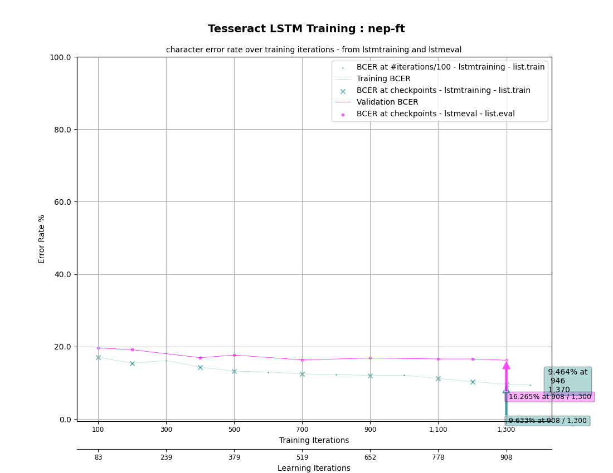

Log plot of the same:


Promising start with quick error rate decrease in the beginning; however this
advantage faded away as BCER approached 12; the decrease plateaud.

Textual log of the training process is in `final/run_4/training.log`

### Run 5

- final attempt

```bash
make training MODEL_NAME=nep-ft START_MODEL=nep TESSDATA=./tessdata EPOCHS=2 LEARNING_RATE=0.002 LANG_TYPE=Indic RANDOM_SEED=42
```

- learning rate slightly increased to 0.002 to try and avoid to 12% BCER plateau

#### Results

Plot of CER:

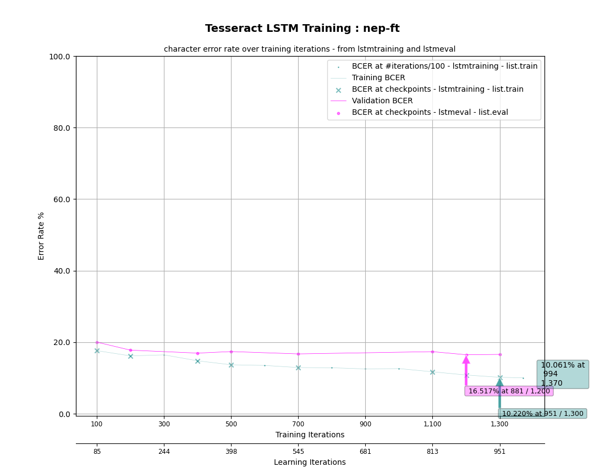

Log plot of the same:

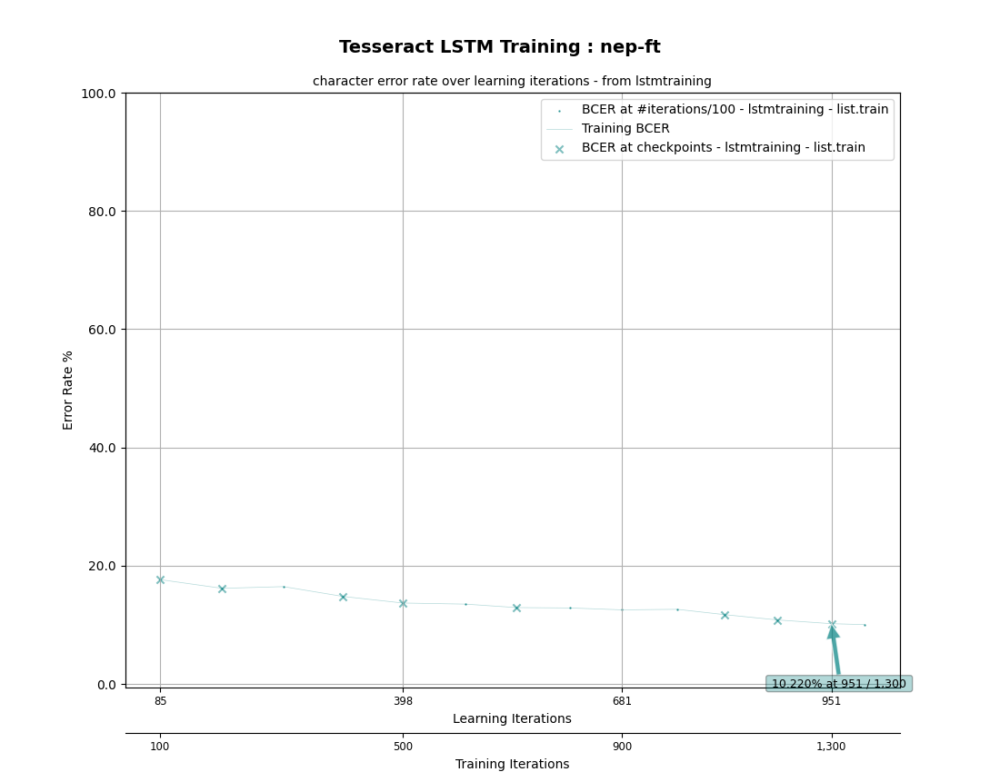

Unfortunately, not much of a breakthrough here; with another plateau at around
13 or so, the last BCER was also worse.

Textual log of the training process is in `final/run_5/training.log`

From the five runs, the fourth (2 epochs and learning rate 0.0015) seems to
provide the best results on unseen data.

### Comparison with base

Comparison done between the best fine tuned model (fourth run), the model
used for the progress defense trained on initial_small, and the base model,
using these `lstmeval` commands, by running on the data set aside for evaluation
purposes:

```bash
# base model
lstmeval \
  --model tessdata/nep.traineddata \
  --eval_listfile data/nep-ft/list.eval \
  --traineddata data/nep-ft/nep-ft.traineddata

# fine-tuned model (initial_small)  
lstmeval \
  --model data/nep-ft.traineddata \
  --eval_listfile data/nep-ft/list.eval \
  --traineddata data/nep-ft/nep-ft.traineddata

# fine-tuned model  
lstmeval \
  --model data/nep-ft-final.traineddata \
  --eval_listfile data/nep-ft/list.eval \
  --traineddata data/nep-ft/nep-ft.traineddata
```

For the base model:

```
BCER eval=26.349, BWER eval=47.088
```

For initial_small fine tuned model:

```
BCER eval=19.740, BWER eval=32.907
```

For final fine tuned model:

```
BCER eval=16.209, BWER eval=25.821
```

The decrease in BWER is drastic, while there is also a sizeable decrease in
BCER.

#### Confidence comparison

The `nep` and `nep-ft-final` models were compared in terms of their accuracy
in transcribing 200 line images, selected randomly from the 762 in the dataset.
This was done via the `confidence_distribution.py` script. The results showed
clearly improved results for the `nep-ft-final` model over the base `nep`
model. This is illustrated via the following histogram:

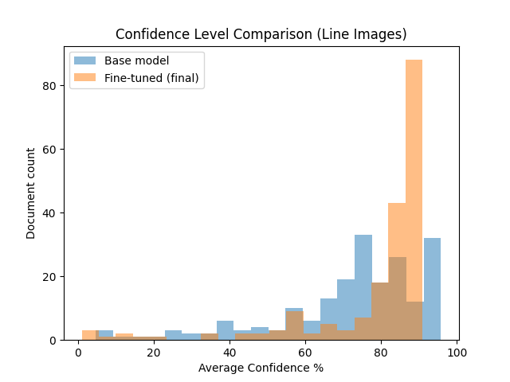

However, doing this same comparison for page images yielded much more ambiguous
results, which were slightly better for the base model. This illustrates that
the performance in lines doesn't always translate to pages.

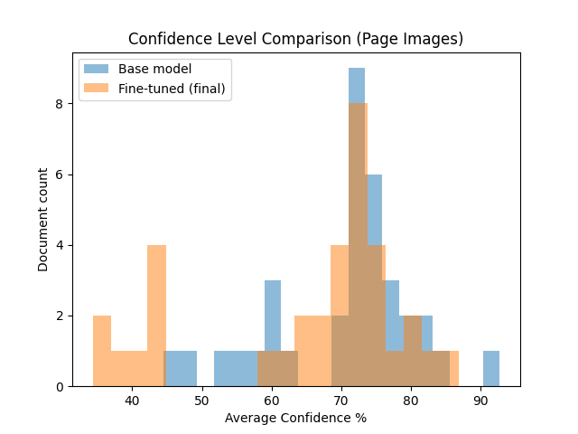

### Run 6

One final run of training done before external defense. Adds 33 manually labeled
lines and 63 synthetic lines (total 96), making a total of 858 training lines.

Same parameters used as run 4.

```bash
make training MODEL_NAME=nep-ft START_MODEL=nep TESSDATA=./tessdata EPOCHS=2 LEARNING_RATE=0.0015 LANG_TYPE=Indic RANDOM_SEED=42
```

#### Results

Plot of CER:

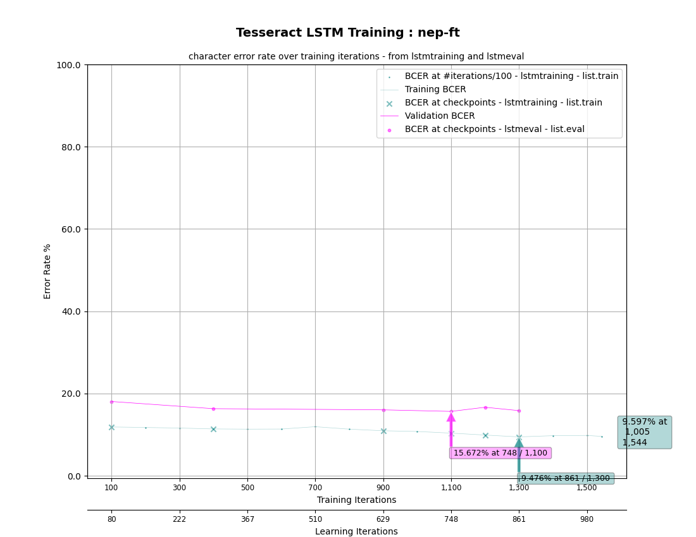

Log plot of the same:

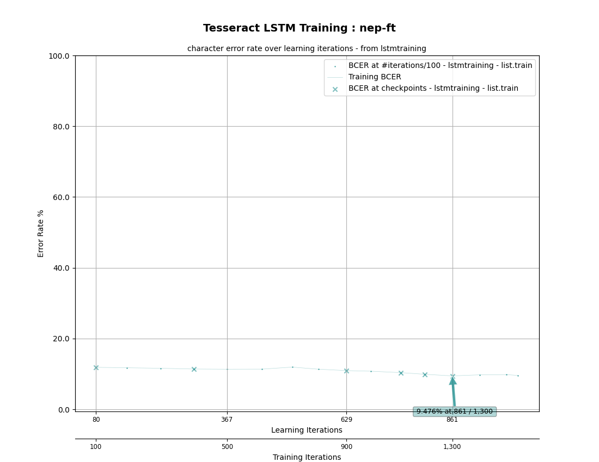

Best run so far.

Textual log of the training process is in `final/run_4/training.log`

### Comparison with base

Done similarly to previous occasion:

```bash
# base model
lstmeval \
  --model tessdata/nep.traineddata \
  --eval_listfile data/nep-ft/list.eval \
  --traineddata data/nep-ft/nep-ft.traineddata

# fine-tuned model (run 4)
lstmeval \
  --model final_trained_models/run_4/nep-ft.traineddata \
  --eval_listfile data/nep-ft/list.eval \
  --traineddata data/nep-ft/nep-ft.traineddata

# fine-tuned model (run 6)
lstmeval \
  --model final_trained_models/run_6_with_extra_data/nep-ft.traineddata \
  --eval_listfile data/nep-ft/list.eval \
  --traineddata data/nep-ft/nep-ft.traineddata
```

For the base model:

```
BCER eval=25.586, BWER eval=45.562
```

For fine tuned model (run 4, 762 line set):

```
BCER eval=15.906, BWER eval=25.071
```

For final fine tuned model (run 6, 858 line set):

```
BCER eval=15.583, BWER eval=23.849
```

Slight improvement.

The run 6 model and the updated dataset will not be used for the final defense.
