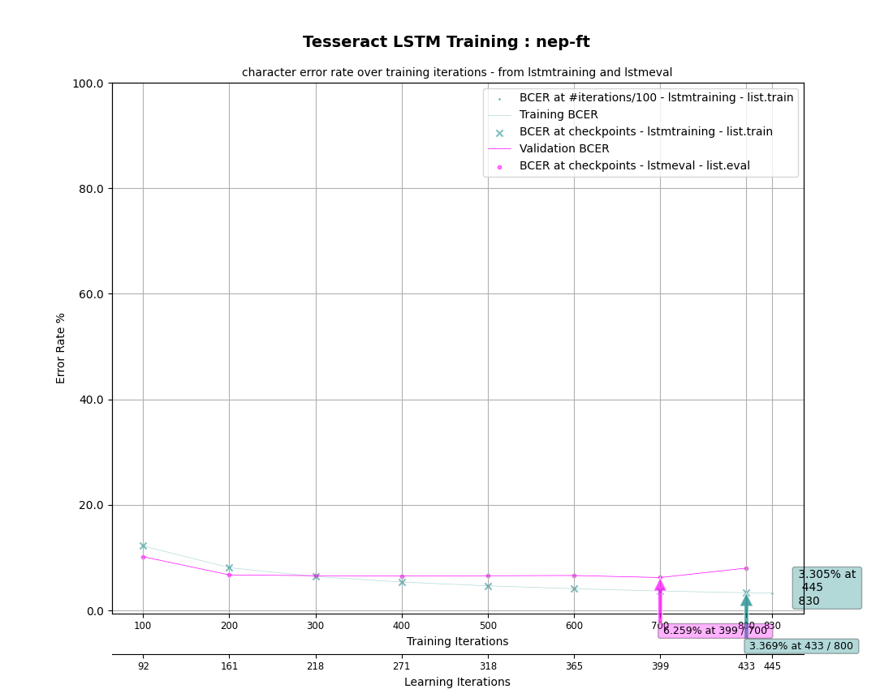

# Training initial_small dataset

- five documents were randomly picked off of `all_images`
- cleaning and line separation setup done by the process described in readme
- manual ground truth creation done
- total of **93 lines** in the end

## Training

- setup the directory structure in `tesstrain` as

```
data
    nep-ft              (empty)
    nep-ft-ground-truth (dataset)
```

- downloaded tesseract langdata

```bash
make tesseract-langdata
```

- ran training as follows:

```bash
make training MODEL_NAME=nep-ft START_MODEL=nep TESSDATA=./tessdata EPOCHS=10 LANG_TYPE=Indic RANDOM_SEED=42
```

- `nep` model provided by Tesseract stored in `./tessdata`, it is fine tuned
- epochs set to only 10 to avoid overfitting on the small dataset, but still have
    some level of data to show
- learning rate set to `0.0001`, which is default when a `START_MODEL` is given
- train-eval ratio set to `0.9`, which is the default, preferred as the dataset is small

### Results

Plot of CER:



Log plot of the same:


Textual log of the training process is in `training_info/initial_small/training_log.txt`
